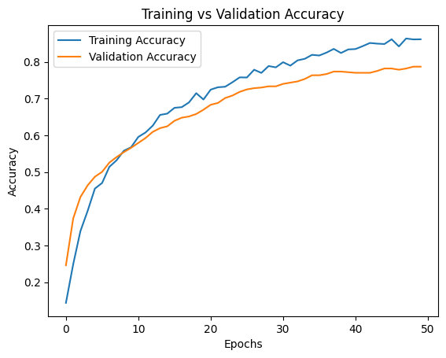
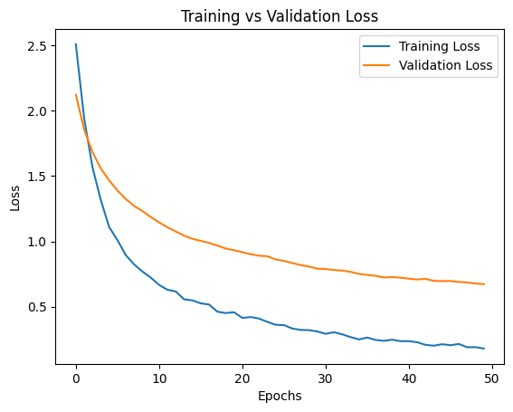

# 🤖 AI-Powered Resume Screening System using Neural Networks

## 📌 Overview

This project is an **AI-based Resume Screening System** that classifies resumes into different job categories using a **Neural Network (TensorFlow/Keras)**.

The goal is to automate the resume screening process and help recruiters quickly identify suitable candidates.

---

## 🚀 Features

* 📄 Resume classification into multiple categories (10 classes)
* 🧠 Deep Learning model using Neural Networks
* 📊 Training vs Validation Accuracy & Loss visualization
* 📈 Performance evaluation using Precision, Recall, F1-score
* ⚖️ Comparison with traditional ML models (Logistic, Random Forest, XGBoost)

---

## 🏗️ Model Architecture

* Dense (256 units) + Batch Normalization + Dropout
* Dense (128 units) + Batch Normalization + Dropout
* Dense (64 units)
* Output Layer (10 classes - Softmax)

**Total Parameters:** 141,898

---

## 📊 Model Performance

### ✅ Accuracy

* Training Accuracy: ~86%
* Validation Accuracy: ~79%
* Test Accuracy: **82.7%**

### 📉 Loss

* Training Loss decreases steadily → Model is learning
* Validation Loss slightly higher → Minor overfitting (acceptable)

---

## 📈 Training Visualization

### Accuracy Graph



### Loss Graph



---

## 📊 Classification Report

| Metric          | Value |
| --------------- | ----- |
| Accuracy        | 0.83  |
| Macro Avg F1    | 0.82  |
| Weighted Avg F1 | 0.84  |

✔ Good balance between precision and recall across classes

---

## ⚖️ Model Comparison

| Model               | Accuracy  |
| ------------------- | --------- |
| Neural Network      | **0.827** |
| Logistic Regression | 0.832     |
| Random Forest       | 0.727     |
| XGBoost             | 0.803     |

👉 Neural Network performs competitively with traditional models.

---

## 🧠 Observations

* Model shows **stable learning without severe overfitting**
* Validation accuracy stabilizes after ~40 epochs
* Batch Normalization improved convergence
* Dropout helps prevent overfitting

---

## 🛠️ Tech Stack

* Python 🐍
* TensorFlow / Keras
* Scikit-learn
* NumPy / Pandas
* Matplotlib

---

## 📂 Project Structure

```
project/
│── accuracy.png
│── loss.png
│── notebook.ipynb
│── README.md
```

---

## ▶️ How to Run

```bash
# Clone repository
git clone https://github.com/your-username/repo-name.git

# Install dependencies
pip install -r requirements.txt

# Run notebook / script
```

---

## 🔮 Future Improvements

* 🌐 Build full-stack web app (React + FastAPI)
* 📄 Add PDF resume upload feature
* 📊 Add confusion matrix visualization
* ⚡ Optimize model using Hyperparameter tuning

---

## 💼 Use Case

* HR Tech Automation
* Resume Filtering Systems
* Job Recommendation Platforms

---

## 👨‍💻 Author

**Tushar Fodse**

---

## ⭐ If you like this project

Give it a ⭐ on GitHub and share!
